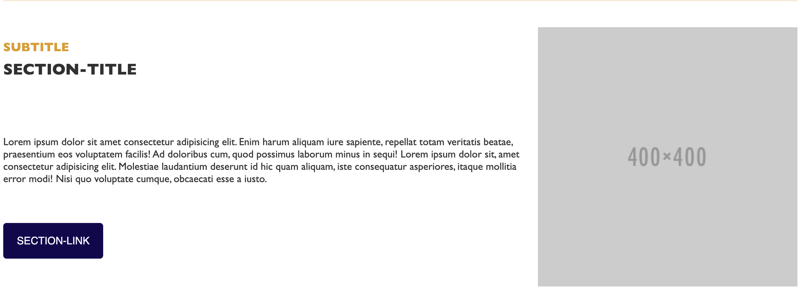

# animated-section

Lit-Element web component animated section, the animation starts when the section comes into focus by scrolling down the screen.

The data is passed using the content of the html code inside the component. The following structure should be used with the same data-id names:

```
<animated-section>
  <div>
    <h2 data-id="sectionTitle"></h2>
    <h3 data-id="sectionSubTitle"></h3>
    <p data-id="sectionText"></p>
    
    <a data-id="sectionLink" href=""></a>
    
    <video data-id="sectionVideo" src="" alt="" type="" ></video>
  </div>
</animated-section>

```
Optional animated-section items:
  * data-id="sectionSubTitle"
  * data-id="sectionImage"
  * data-id="sectionLink"
  * data-id="sectionNoVideoMobile"
  * data-id="sectionVideo"

## Demo



### animated-section no imagen
```
<animated-section animation="true" position-text="before">
  <div>
    <h2 data-id="sectionTitle">SECTION-TITLE</h2>
      <h3 data-id="sectionSubTitle">SUBTITLE</h3>
      <p data-id="sectionText">Lorem ipsum dolor sit amet consectetur adipisicing elit. Enim harum aliquam iure sapiente, repellat totam veritatis beatae,  praesentium eos voluptatem facilis! Ad doloribus cum, quod possimus laborum minus in sequi! Lorem ipsum dolor sit, amet consectetur adipisicing elit. Molestiae laudantium deserunt id hic quam aliquam, iste consequatur asperiores, itaque mollitia error modi! Nisi quo voluptate cumque, obcaecati esse a iusto.</p>
    </div>
</animated-section>
```


### animated-section with image and link 
```
<animated-section animation="true" position-text="before">
    <div>
      <h2 data-id="sectionTitle">SECTION-TITLE</h2>
        <h3 data-id="sectionSubTitle">SUBTITLE</h3>
        <p data-id="sectionText">Lorem ipsum dolor sit amet consectetur adipisicing elit. Enim harum aliquam iure sapiente, repellat totam veritatis beatae, praesentium eos voluptatem facilis! Ad doloribus cum, quod possimus laborum minus in sequi! Lorem ipsum dolor sit, amet consectetur adipisicing elit. Molestiae laudantium deserunt id hic quam aliquam, iste consequatur asperiores, itaque mollitia error modi! Nisi quo voluptate cumque, obcaecati esse a iusto.</p>
        
        <a data-id="sectionLink" href="/">SECTION-LINK</a>
      </div>
  </animated-section>
```
### animated-section with video in mobile and desktop
```
<animated-section position-text="after" animation="true">
  <div>
    <h2 data-id="sectionTitle">SECTION-TITLE</h2>
    <h3 data-id="sectionSubTitle">SUBTITLE</h3>
      <p data-id="sectionText">Lorem ipsum dolor sit amet consectetur adipisicing elit. Enim harum aliquam iure sapiente, repellat totam veritatis beatae, praesentium eos voluptatem facilis! Ad doloribus cum, quod possimus laborum minus in sequi! Lorem ipsum dolor sit, amet consectetur adipisicing elit. Molestiae laudantium deserunt id hic quam aliquam, iste consequatur asperiores, itaque mollitia error modi! Nisi quo voluptate cumque, obcaecati esse a iusto.</p>
      <video data-id="sectionVideo" src="/demo/assets/Globe12486.mp4" alt="video mimundo" type="video/mp4" ></video>
    </div>
</animated-section>
```

### animated-section with image in mobile and video in desktop
```
<animated-section position-text="after" animation="true">
  <div>
    <h2 data-id="sectionTitle">SECTION-TITLE</h2>
    <h3 data-id="sectionSubTitle">SUBTITLE</h3>
      <p data-id="sectionText">Lorem ipsum dolor sit amet consectetur adipisicing elit. Enim harum aliquam iure sapiente, repellat totam veritatis beatae, praesentium eos voluptatem facilis! Ad doloribus cum, quod possimus laborum minus in sequi! Lorem ipsum dolor sit, amet consectetur adipisicing elit. Molestiae laudantium deserunt id hic quam aliquam, iste consequatur asperiores, itaque mollitia error modi! Nisi quo voluptate cumque, obcaecati esse a iusto.</p>
      
      <video data-id="sectionVideo" src="/demo/assets/Globe12486.mp4" alt="video mimundo" type="video/mp4" ></video>
    </div>
</animated-section>
```

```html
<animated-section></animated-section>
```

## Properties

|                |  Attribute      |  Type                  | Description			                                                                      |                 
|----------------|-----------------|------------------------|---------------------------------------------------------------------------------------|
|animation       |  animation      |Boolen                  |True: section is animated                                                              |
|positionText    |  position-text  |Options: {after\|before}|After: the text is positioned to the left of the image <br>Before: the text is positioned to the right of the image 

## CSS Custom Properties


|      Name                    |  Description                          
|-----------------------------|---------------------------------------------------------|
|--main-font-family		        |  Font-family to the main component                      |
|--grid-desktop-column-width  |  Column width of grid layout in desktop; Default is auto|
|--grid-column-gap            |  Column gap  width of grid layout in desktop            |    

## CSS Shadow Parts

|      Name            |  Description                          
|----------------------|----------------------------------------------------------|
|section-title		     |The title of the section                                  |
|section-subtitle      |The subtitle of the section                               |
|section-description   |The description text  of the section                      |
|section-link   	     |The link of the section                                   |
|section-media  	     |The image/video of the section                            |


## Install the Polymer-CLI

First, make sure you have the [Polymer CLI](https://www.npmjs.com/package/polymer-cli) and npm (packaged with [Node.js](https://nodejs.org)) installed. Run `npm install` to install your element's dependencies, then run `polymer serve` to serve your element locally.

## Viewing Your Element

```
$ npm run start
```

## Running Tests

```
$ npm run test
```

## Build
```
$ npm run build
```

## Author

**KairósDS Team**

## License

This project is licensed under the Apache 2.0 License - see the [LICENSE](LICENSE) file for details